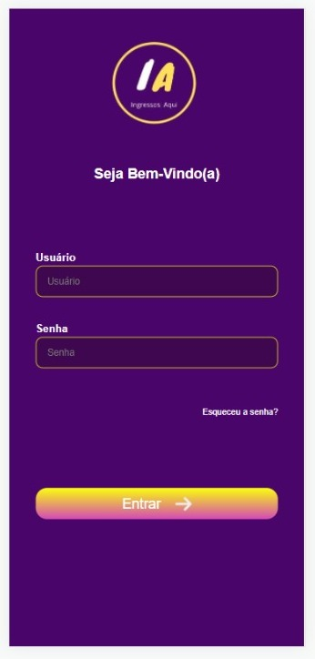
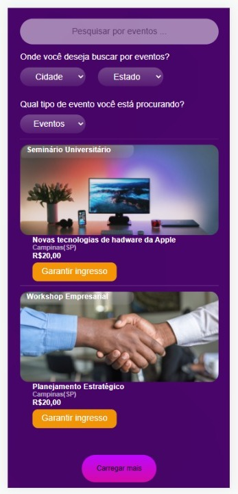
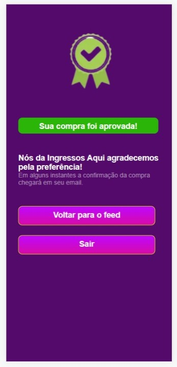

# Desafio MBlabs 🚀
  

<h2> App de venda de Ingressos para eventos Universitários e Empresariais 📱 </h2>
  

  

<ol>
    <li> A primeira tela é a de Login, partindo do princípio que o usuário já tenha cadastro no app;
    </li>
    <li> A segunda tela é a de "feed", onde o usuário teria acesso aos ingressos e o direito de filtrar sua busca, buscando a localidade e o tipo do evento (Empresarial ou Universitário);
    </li>
    <li> A terceira tela é a de compra, onde o usuário informaria alguns critérios para a realização da compra do ingresso;
    </li>
    <li> A quarta e última tela é a de agradecimento ou compra aprovada. Tendo as opções de voltar para o feed para a aquisição de novos ingressos e de saída do app retornando a tela de login.
    </li>
</ol>
   
👨🏽‍💻--------------------------------------------------------------------------------👨🏽‍💻
  
<h2> Ferramentas e tecnologias utilizadas 🖥️👨🏽‍💻</h2>

<ul>
    <li> Javascript ✅ </li>
    <li> Reactjs ✅ </li>
    <li> Styled-components ✅ </li>
    <li> React-router-dom ✅ </li>
</ul>    
  

👨🏽‍💻--------------------------------------------------------------------------------👨🏽‍💻

